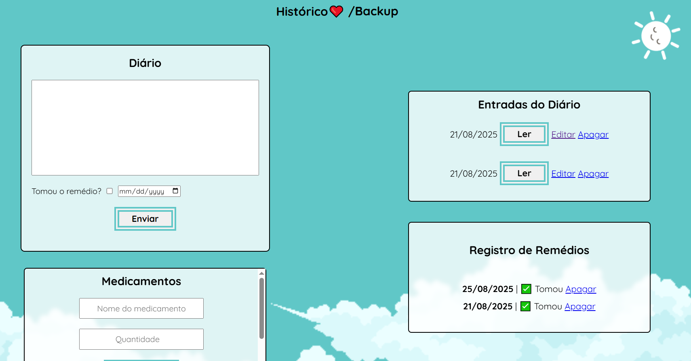
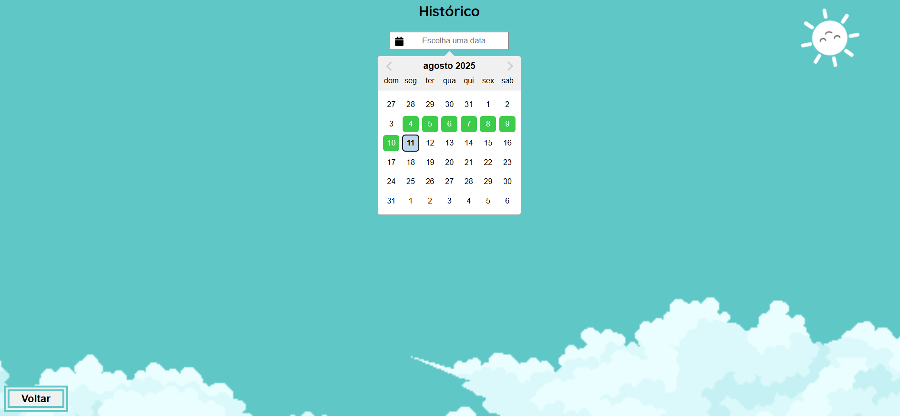

💊 Dose de Mim — Mini-Guia de Setup

O Dose de Mim foi inicialmente pensado para pessoas trans manterem o registro de seu acompanhamento médico. Mas que pode ser útil para qualquer pessoa que deseja se cuidar. ❤

É um app que permite:
- Gerenciar quais medicamentos e suas quantidades está tomando
- Escrever, editar e excluir tanto diários quanto os medicamentos e registros de remédios
- Permite escolher a data da postagem
- Possui a função de backup localmente ou em nuvem (Dropbox)
- Possui uma página chamada calendário onde permite que veja de forma mais adequada seus registros e até editar os diários

Este app continua em constante melhoria e junto de aprendizados, ficarei feliz caso alguém queira colaborar, seja com as suas ideias ou códigos. 🥰

No momento penso em adicionar uma espécie de senha para entrar no App.

---

## 🤳 Screenshots





## 1️⃣ Clone o repositório

No terminal:

```bash
git clone https://github.com/lorena-domingos/dose-de-mim.git
cd dose-de-mim
```

---

## 2️⃣ Crie e ative o ambiente virtual

### Windows (PowerShell):

```powershell
python -m venv .venv
.venv\Scripts\activate
```

### Linux/macOS:

```bash
python -m venv .venv
source .venv/bin/activate
```

---

## 3️⃣ Instale as dependências

```bash
pip install -r requirements.txt
```
Vai baixar Flask, Dropbox SDK, etc.

---

## 4️⃣ Crie seu APP no Dropbox

Vai no [Dropbox Developers](https://www.dropbox.com/developers/apps) e cria um app.

Escolhe o tipo de acesso que você quer: Full Dropbox (acesso a tudo) ou App Folder (uma pasta só do app).

Depois de criar, vai ter App Key e App Secret — você vai precisar deles no seu script.

## 5️⃣ Gerando o `REFRESH_TOKEN` do Dropbox

_Lembrando que irá precisar do App Key e App Secret para gerar o Refresh Token._

1. Navegue até a pasta do projeto.
2. Rode:

```bash
python utils/dropbox_auth.py
```

3. O navegador vai abrir pedindo login no Dropbox.
4. No final, o script mostra o `REFRESH_TOKEN`.

🔑 Copie e coloque no `.env` ou nas variáveis do sistema.

---

## 6️⃣ Configure as variáveis de ambiente

Você tem **duas opções**:

### 🔹 Opção A: Variáveis do sistema

No Windows (PowerShell):

```powershell
setx APP_KEY "sua_app_key"
setx APP_SECRET "seu_app_secret"
setx REFRESH_TOKEN "seu_refresh_token"
```

No Linux/macOS (bash/zsh):

```bash
export APP_KEY="sua_app_key"
export APP_SECRET="seu_app_secret"
export REFRESH_TOKEN="seu_refresh_token"
```

---

### 🔹 Opção B: Arquivo `.env`

1. Crie um arquivo chamado `.env` na raiz do projeto.
2. Coloque dentro:

```ini
APP_KEY=sua_app_key
APP_SECRET=sua_app_secret
REFRESH_TOKEN=seu_refresh_token
```

---


## 7️⃣ Rodando o servidor Flask

No terminal, com o ambiente virtual ativo:

```bash
flask run
```

Flask vai subir o site. Abra o navegador em: [http://localhost:5000](http://localhost:5000)

---

## 8️⃣ Visualizando a página

* A página inicial mostra seu diário e remédios.
* O botão de **Histórico / Calendário** abre a página de histórico (React).
* Todas alterações salvam no **SQLite** e fazem backup no **Dropbox** ou localmente.
---

## ✅ Dicas visuais rápidas

* `.venv/` = ambiente virtual
* `.env` = credenciais Dropbox se você não quiser mexer no sistema
* `utils/dropbox_auth.py` = script mágico pra gerar token
* `database.db` = SQLite que guarda diário e remédios
* `controllers/` = rotas
* `models/` = funções de acesso ao banco

## Calendário

Aqui é onde a página de calendário feita com React fica. Onde a sua ‘build’ é colocada em `static/calendario`.

[Repositório](https://github.com/lorena-domingos/dose-de-mim-calendario)
