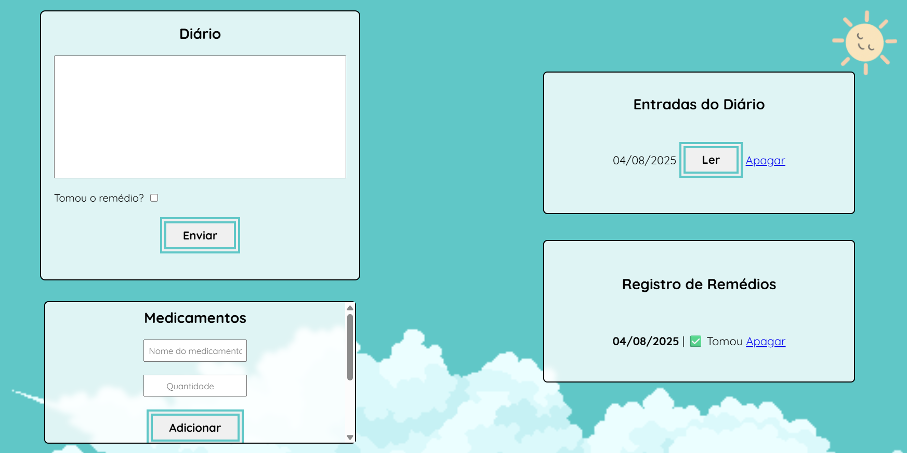

# 💊 Dose de Mim — Diário Pessoal com Flask

Esse é um app web feito com Flask onde você pode registrar seus sentimentos, humor e se tomou ou não o remédio do dia. Ele também salva um pequeno diário pra você se cuidar com carinho.



## 🌟 Funcionalidades

- Adicionar entradas no diário com emoji de humor
- Marcar se tomou o remédio ou não
- Visualizar histórico de entradas
- Excluir entradas quando quiser
- 💊 Adicionar medicamentos

## 🚀 Como rodar o projeto

### 1. Clone o repositório

```bash
git clone https://github.com/seu-usuario/seu-repo.git
cd seu-repo
````

### 2. Crie e ative um ambiente virtual (opcional, mas recomendado)

```bash
python -m venv venv
source venv/bin/activate   # no Linux/macOS
venv\Scripts\activate      # no Windows
```

### 3. Instale as dependências

```bash
pip install -r requirements.txt
```

### 4. Inicie o servidor

```bash
flask run
```

O app vai estar disponível em [http://localhost:5000](http://localhost:5000) 💻

## 🗃️ Banco de Dados

O projeto usa SQLite e já vem com a estrutura pronta. O arquivo do banco (`database.db`) será criado automaticamente na primeira execução.

## 📦 Dependências

Veja todas as dependências no arquivo `requirements.txt`.

## ✨ To-Do

* [ ] Senha
* [ ] Filtrar entradas por data
* [ ] Editar entradas do diário
* [x] Melhorar estilo e responsividade
* [x] Remover entrada de emoji no banco de dados


## 🎨 Materiais Utilizados

Nuvens: https://free-game-assets.itch.io/free-sky-with-clouds-background-pixel-art-set

