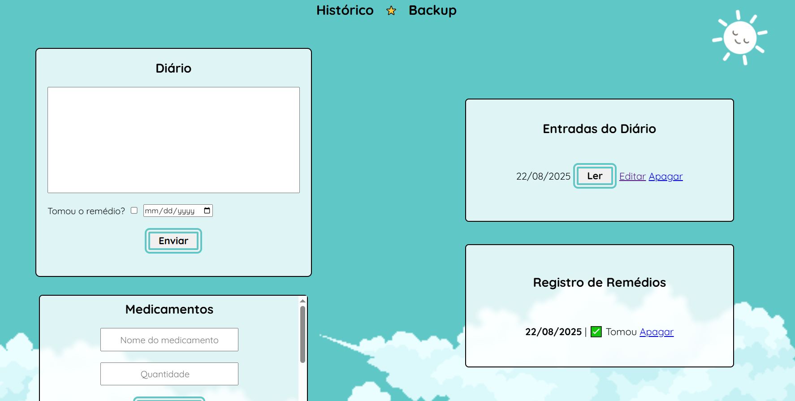

# 💊 Dose de Mim — Mini-Guia Visual de Setup

Esse guia é pra quem nunca mexeu com Flask ou Dropbox. Aqui você vai ver exatamente **onde colocar variáveis, gerar o token e rodar o servidor**.

---

## 🤳 Screenshots




## 1️⃣ Clone o repositório

No terminal:

```bash
git clone https://github.com/seu-usuario/seu-repo.git
cd seu-repo
```

> 🖼 Imagina: a pasta do projeto agora está no seu computador com `app.py`, `controllers/`, `models/`, etc.

---

## 2️⃣ Crie e ative o ambiente virtual

### Windows (PowerShell):

```powershell
python -m venv .venv
.venv\Scripts\activate
```

### Linux/macOS:

```bash
python -m venv .venv
source .venv/bin/activate
```

> 🖼 Mental: você ativou um “espaço limpo” só pro projeto. Dependências não bagunçam seu Python global.

---

## 3️⃣ Instale as dependências

```bash
pip install -r requirements.txt
```

> 🖼 Mental: pip vai baixar Flask, Dropbox SDK, python-dotenv, etc.

---

## 4️⃣ Configure as variáveis de ambiente

Você tem **duas opções**:

### 🔹 Opção A: Variáveis do sistema

No Windows (PowerShell):

```powershell
setx APP_KEY "sua_app_key"
setx APP_SECRET "seu_app_secret"
setx REFRESH_TOKEN "seu_refresh_token"
```

No Linux/macOS (bash/zsh):

```bash
export APP_KEY="sua_app_key"
export APP_SECRET="seu_app_secret"
export REFRESH_TOKEN="seu_refresh_token"
```

> 🖼 Mental: o sistema agora “sabe” suas credenciais do Dropbox.

---

### 🔹 Opção B: Arquivo `.env`

1. Crie um arquivo chamado `.env` na raiz do projeto.
2. Coloque dentro:

```ini
APP_KEY=sua_app_key
APP_SECRET=sua_app_secret
REFRESH_TOKEN=seu_refresh_token
```

> 🖼 Mental: o script em `utils` lê isso automaticamente, sem precisar mexer no sistema.

---

## 5️⃣ Gerando o `REFRESH_TOKEN` do Dropbox

1. Abra o terminal no projeto.
2. Rode:

```bash
python utils/dropbox_auth.py
```

3. O navegador vai abrir pedindo login no Dropbox.
4. No final, o script mostra o `REFRESH_TOKEN`.

> 🖼 Mental: você acabou de criar a chave que o app vai usar pra fazer backup.
> 🔑 Copie e coloque no `.env` ou nas variáveis do sistema.

---

## 6️⃣ Rodando o servidor Flask

No terminal, com o ambiente virtual ativo:

```bash
flask run
```

> 🖼 Mental: Flask vai subir o site.
> Abra o navegador em: [http://localhost:5000](http://localhost:5000)

---

## 7️⃣ Visualizando a página

* A página inicial mostra seu diário e remédios.
* O botão de **Histórico / Calendário** abre a página de histórico (React).
* Todas alterações salvam no **SQLite** e fazem backup no **Dropbox**.

> 🖼 Mental: tudo funcionando! Texto, remédio, diário e backup automático.

---

## ✅ Dicas visuais rápidas

* `.venv/` = ambiente virtual
* `.env` = credenciais Dropbox se você não quiser mexer no sistema
* `utils/dropbox_auth.py` = script mágico pra gerar token
* `database.db` = SQLite que guarda diário e remédios
* `controllers/` = rotas
* `models/` = funções de acesso ao banco

